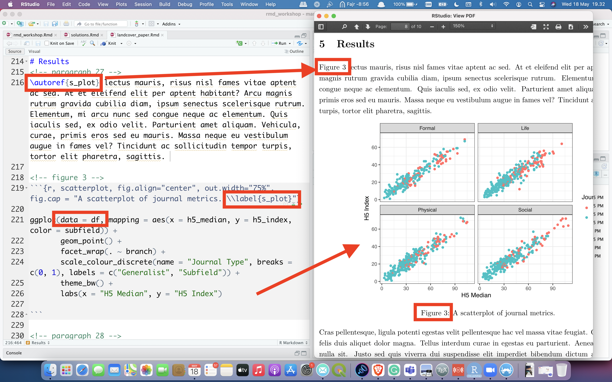

name: title-slide
class: inverse, center, middle

```{r setup, include=FALSE}
options(htmltools.dir.version = FALSE, crayon.enabled = TRUE)

library(bibtex)
library(countdown)
library(crayon)
library(dplyr)
library(fansi)
library(ggplot2)
library(RefManageR)
library(stargazer)

# data
df <- read.csv("rmd_workshop_files/images_data/journals.csv") %>% 
      mutate(subfield = as.factor(subfield), 
             english = as.factor(english),
             age = 2020 - since) %>%
      select(-since)

# regression models
lm1 <- lm(h5_index ~ issues, data = df)
lm2 <- lm(h5_index ~ issues + english, data = df)
lm3 <- lm(h5_index ~ issues + english + subfield, data = df)
lm4 <- lm(h5_index ~ issues + english + subfield + age, data = df)

# references
packages <- c("rmarkdown", "tinytex", "dplyr", "stargazer", "ggplot2", 
              "base", "fabricatr", "data.table", "stringi", "huxtable", 
              "plotly", "knitr", "bookdown", "blogdown", "kableExtra")

knitr::write_bib(packages, "rmd_workshop_files/bibliography/packages.bib")

bib_files <- c("rmd_workshop_files/bibliography/packages.bib", 
               "rmd_workshop_files/bibliography/manuals.bib")
bib_data <- lapply(bib_files, readLines)
write(unlist(bib_data),
      file = "rmd_workshop_files/bibliography/presentation.bib")

BibOptions(check.entries = FALSE,
           bib.style = "authoryear",
           cite.style = "authoryear",
           style = "markdown",
           hyperlink = "to.doc",
           dashed = FALSE)

bibliography <- ReadBib("rmd_workshop_files/bibliography/presentation.bib", 
                        check = FALSE)

```


<style type="text/css">

.hljs-github .hljs {
    background: #e5e5e5;
}

.inline-c, remark-inline-code {
   background: #e5e5e5;
   border-radius: 3px;
   padding: 4px;
   font-family: 'Source Code Pro', 'Lucida Console', Monaco, monospace;
}


.yellow-h{
   background: #ffff88;
}

.red-h{
   background: #ff8888;
}


.out-t, remark-inline-code {
   background: #9fff9f;
   border-radius: 3px;
   padding: 4px;
   
}

.pull-left-c {
    float: left;
    width: 58%;
    
}

.pull-right-c {
    float: right;
    width: 38%;
    
}


.pull-left-c1 {
    float: left;
    width: 45%;
    
}

.pull-right-c2 {
    float: right;
    width: 50%;
    
}

.medium {
    font-size: 75%
    
}

.small {
    font-size: 50%
    }

.action {
    background-color: #f2eecb;
  
}


</style>


# Pengantar Reproducible Research Menggunakan R

<br>

### Firman Hadi

### 19 Mei 2022


---
## Who am I?

Firman Hadi

- Staf pengajar Departemen Teknik Geodesi, Fakultas Teknik, Universitas Diponegoro

- Quality Panel, [High Conversation Value Resource Network](https://hcvnetwork.org) 

--

- "Presiden" [OSGEO Indonesia](https://osgeo.id) 

--

<br>

- Catatan, rekaman video tutorial dan kursus dapat dilihat di [https://firmanhadi.github.io](https://firmanhadi.github.io/) dan [https://sigro.id](https://sigro.id)

---

## Disclaimer

- Saya .red-h[bukan] seorang ahli statistik.

--

- Saya .red-h[tidak] mahir menggunakan R.

--

- Saya .red-h[tidak] menguasai pemrograman.

--

- Saya .yellow-h[hanya] .red-h["yesterday afternoon son"] (Soeharmono, 2021) dan seorang .out-t["konsultan"].
    
---
## On being a consultant

.pull-left-c1[


]

.pull-right-c2[

]

---
## Aims

- Pengalaman adalah guru yang terbaik.

--

- Belajar dari pengalaman adalah metode belajar yang terbaik.

--

- Apakah ada yang lebih baik dari itu?

--

`r countdown(minutes = 0, seconds = 30, top = 0)`

--

- .red-h[Belajar] dari orang yang .out-t[berpengalaman].

--

- Tujuan sesi ini adalah .out-t[berbagi pengalaman].

---
## Reproducible research


---
## Reproducible research at UNDIP

{width=20%}
---

## Reproducible research at UNDIP

{width=20%}
---
## Reproducible research at UNDIP

{width=20%}
---
## How did I use to write?

First, with .yellow-h[Excel + Word], I was ...

- frustrated with Word
    - formatting tables, figures, citations, and equations 
    - managing references
    
- tired of switching between programmes/screens
    - and, worried about making mistakes in between
    
- used the .red-h[illegal] version

.footnote[

(Resul Umit, 2020) [https://github.com/resulumit/rmd_workshop]

]
---
## How did I use to write?

.pull-left-c[
Then, with .yellow-h[OpenOffice + R + LaTeX], I was ...

- ~~frustrated with Word~~
    - ~~formatting tables, figures, citations, and equations~~ 
    - ~~managing references~~

- ~~used the .red-h[illegal] versione~~

- tired of switching between programmes/screens
    - and, worried about making mistakes in between
    
- converting PDF documents to Word manually
    - coordinating work with co-authors who don't use LaTeX/PDF
    - submitting to journals which don't accept LaTeX/PDF

]

.pull-right-c[

]

.footnote[

(Resul Umit, 2020) [https://github.com/resulumit/rmd_workshop]

]
---
## How do I write now?

Now, with .yellow-h[R Markdown], I am ... happy!

- ~~frustrated with Word~~
    - ~~formatting tables, figures, citations, and equations~~ 
    - ~~managing references~~
    
- ~~tired of switching between programmes/screens~~
    - ~~and, worried about making mistakes in between~~
    
- ~~used the .red-h[illegal] versione~~

- ~~converting PDF documents to Word, manually~~
    - ~~coordinating work with co-authors who don't use LaTeX/PDF~~
    - ~~submitting to journals which don't accept LaTeX/PDF~~

.footnote[

(Resul Umit, 2020) [https://github.com/resulumit/rmd_workshop]

]
---
## R Markdown

- Efficient

   - write text, cite sources, tidy data, analyse, table, and plot it in one programme/screen
   - re-do one, more, or all of these with ease
       - decrease the possibility of making mistakes in the process
       
--

- Flexible

    - output to various formats
        - e.g., HTML, LaTeX, PDF, Word
        
--

- Open access/source

   - use for free
   - create documents accessible to anyone with a computer and internet connection
   - benefit from the work of a great community of users/developers

.footnote[

(Resul Umit, 2020) [https://github.com/resulumit/rmd_workshop]

]   
---
## Reproducibility &mdash; Before Publication

- Having written a complete draft

    - with data including re-coded variables, tables, figures, and text with references to specific results (e.g., numbers from summary and/or regression statistics)

--

- If you and/or your co-authors decide 

    - to reverse a re-coded variable to its previous/original measure
    - and/or, to exclude a subgroup of observations from analysis

--

- How resource intensive would this revision be?

    - how long would this revision take?
    - how many programmes would be needed for this revision, and how much would they cost?
    - there is an inverse relationship between this resource intensity and reproducibilty
    
.footnote[

(Resul Umit, 2020) [https://github.com/resulumit/rmd_workshop]

]
---
## Reproducibility &mdash; After Publication

- After your paper is published, if others, including your future self, would like to test how robust the results are

    - to reversing a re-coded variable to its previous/original measure
    - and/or, to excluding a subgroup of observations from analysis

--

- How resource intensive would this test be?

    - how accessible is the data, documentation (how was the variable re-coded in the first place?), and the code?
    - how long would the test take?
    - how many programmes would be needed for this revision, and how much would they cost?
    - there is an inverse relationship between this resource intensity and reproducibilty

.footnote[

(Resul Umit, 2020) [https://github.com/resulumit/rmd_workshop]

]
---

## R Markdown Document &mdash; Components

.pull-left-c[

Observe also that the document has three components

 - .yellow-h[YAML]
]

.pull-right-c[

]

---
## R Markdown Document &mdash; Components

.pull-left-c[

Observe also that the document has three components

 - YAML
 - .yellow-h[text]
]

.pull-right-c[


]

.footnote[

(Resul Umit, 2020) [https://github.com/resulumit/rmd_workshop]

]
---
## R Markdown Document &mdash; Components

.pull-left-c[

Observe also that the document has three components

 - YAML
 - text
 - .yellow-h[code chunks]
 
]

.pull-right-c[


]

.footnote[

(Resul Umit, 2020) [https://github.com/resulumit/rmd_workshop]

]

---
class: action

## R Markdown Document &mdash; Compile

.pull-left-c[
- Click the `Knit` button to compile your .Rmd document, and observe that 

  - the output document has the same name as your .Rmd document

- You may want to delete these newly created files, as we will work with `journals.Rmd` instead to save time. 

]

.pull-right-c[

```{r, echo = FALSE, out.width = "95%"}
knitr::include_graphics("rmd_workshop_files/images_data/first_rmd.png")
```

]

.footnote[

(Resul Umit, 2020) [https://github.com/resulumit/rmd_workshop]

]

---
## References &mdash; In-text Citation Syntax &mdash; Author-Date Styles<sup>*</sup>

All citations keys take the 'at' sign .yellow-h[@] while square brackets and/or minus signs introduce variation


.pull-left[

.inline-c[[@bennett2015]] becomes .out-t[(Bennett, 2015)]

.inline-c[@bennett2015] becomes .out-t[Bennett (2015)]

.inline-c[[-@bennett2015]] becomes .out-t[(2015)]

.inline-c[-@bennett2015] becomes .out-t[2015]

.inline-c[[@bennett2015 35]] becomes .out-t[(Bennett, 2015, p. 35)]

.inline-c[[@bennett2015 33-35]] becomes .out-t[(Bennett, 2015, pp. 33&ndash;35)]


]

.pull-right[

.inline-c[[@bennett2015, ch. 1]] becomes .out-t[(Bennett, 2015, ch. 1)]

.inline-c[[@bennett2015; @gilbert2019]] becomes .out-t[(Bennett, 2015; Gilbert, 2019)]

.inline-c[[see @bennett2015, for details]] becomes .out-t[(see Bennett, 2015, for details)]

.inline-c[@bennett2015 [33-35]] becomes .out-t[Bennett (2015, pp. 33&ndash;35)]

]

.footnote[

<sup>*</sup> Specifically, the outputs on this slide are formatted according to the APA 7<sup>th</sup> edition.
<br>
(Resul Umit, 2020) [https://github.com/resulumit/rmd_workshop]


]

---

class: action

## Example


---

class: action

## Example


---

class: action

## Example


---

class: action

## Example



---

class: action, middle, center

# Demonstration

---

class: action, middle, center

# Terima kasih atas Bapak/Ibu sekalian.


```{r, print, eval=FALSE, echo=FALSE, message=FALSE}
pagedown::chrome_print("rmd_workshop.html", output = "rmd_workshop.pdf")
```